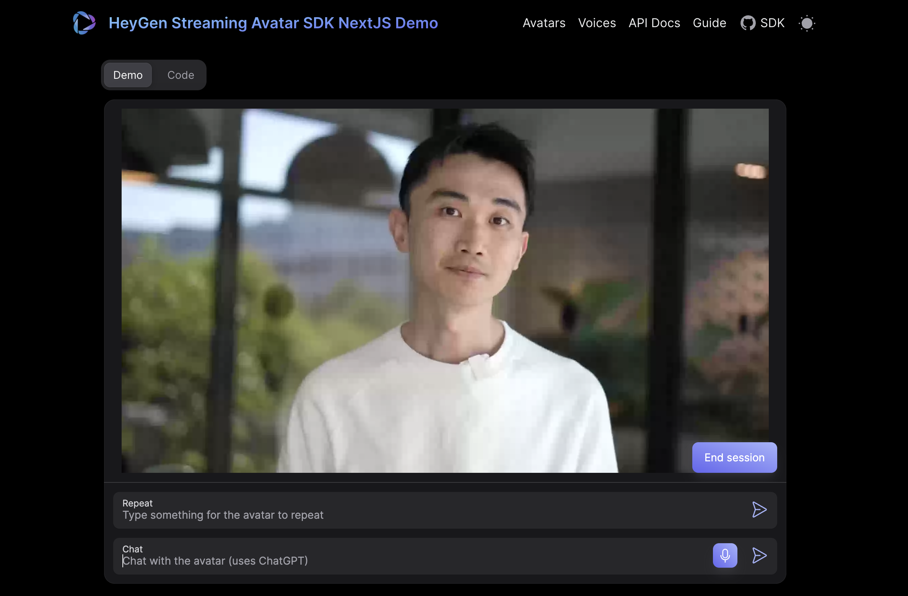

# HeyGen Interactive Avatar NextJS Demo



This is a sample project and was bootstrapped using [NextJS](https://nextjs.org/).
Feel free to play around with the existing code and please leave any feedback for the SDK [here](https://github.com/HeyGen-Official/StreamingAvatarSDK/discussions).

## Getting Started FAQ

### Setting up the demo

1. Clone this repo

2. Navigate to the repo folder in your terminal

3. Run `npm install` (assuming you have npm installed. If not, please follow these instructions: https://docs.npmjs.com/downloading-and-installing-node-js-and-npm/)

4. Enter your HeyGen Enterprise API Token in the `.env` file. Replace `HEYGEN_API_KEY` with your API key. This will allow the Client app to generate secure Access Tokens with which to create interactive sessions.

   You can retrieve either the API Key by logging in to HeyGen and navigating to this page in your settings: [https://app.heygen.com/settings?from=&nav=Subscriptions%20%26%20API]. 

5. To use the OpenAI integration for avatar responses, create a `.env.local` file in the root directory and add your OpenAI API key:
   ```
   OPENAI_API_KEY=your_openai_api_key_here
   ```
   This will enable the avatar to respond to your questions using OpenAI's language model.

6. Run `npm run dev`

### Starting sessions

NOTE: Make sure you have enter your token into the `.env` file and run `npm run dev`.

To start your 'session' with a Interactive Avatar, first click the 'start' button. If your HeyGen API key is entered into the Server's .env file, then you should see our demo Interactive Avatar appear.

If you want to see a different Avatar or try a different voice, you can close the session and enter the IDs and then 'start' the session again. Please see below for information on where to retrieve different Avatar and voice IDs that you can use.

### Which Avatars can I use with this project?

By default, there are several Public Avatars that can be used in Interactive Avatar. (AKA Interactive Avatars.) You can find the Avatar IDs for these Public Avatars by navigating to [labs.heygen.com/interactive-avatar](https://labs.heygen.com/interactive-avatar) and clicking 'Select Avatar' and copying the avatar id.

You can create your own custom Interactive Avatars at labs.heygen.com/interactive-avatar by clicking 'create interactive avatar' on the top-left of the screen.

### Using the OpenAI-powered Question Answering Feature

This demo includes an integration with OpenAI that allows you to ask questions to the avatar:

1. Make sure you've added your OpenAI API key to the `.env.local` file as described in the setup instructions.
2. Start a session with an avatar.
3. Type your question in the text input field at the bottom of the screen.
4. Click the send button or press Enter.
5. The avatar will pause, process your question through OpenAI, and then speak the response.

This feature demonstrates how to integrate AI-powered responses with the HeyGen Interactive Avatar, creating a more dynamic and intelligent conversation experience.

### Using the OpenAI Assistant API Integration

This demo now includes an enhanced integration with OpenAI's Assistant API, which provides more context-aware and conversational responses:

1. Make sure you've added your OpenAI API key to the `.env.local` file as described in the setup instructions.
2. Start a session with an avatar.
3. Ensure the "Use OpenAI Assistant" checkbox is enabled (it's enabled by default).
4. Type your question in the text input field at the bottom of the screen.
5. Click the send button or press Enter.
6. The avatar will process your question through the OpenAI Assistant API and speak the response.

The Assistant API maintains conversation context across multiple messages, allowing for more natural and coherent interactions. The implementation:

- Creates a persistent assistant and thread for the session
- Sends user messages to the OpenAI Assistant
- Retrieves AI-generated responses
- Makes the avatar speak those responses

You can customize the assistant's behavior by modifying the instructions in the OpenAI API route file.

### Training the Avatar with Organization-Specific Knowledge

This demo includes a knowledge base management system that allows you to train the OpenAI Assistant with your organization's specific information:

1. Click the "Manage Knowledge Base" link at the top of the main page.
2. Upload PDF, DOCX, or TXT files containing your organization's knowledge.
3. The files will be processed and added to the OpenAI Assistant's knowledge base.
4. When users ask questions, the avatar will now prioritize information from your uploaded documents.

This feature enables the avatar to provide accurate, organization-specific responses. For example:
- Upload your company's product documentation
- Add FAQs, policies, or procedures
- Include technical specifications or user guides

The knowledge base integration ensures that the avatar can answer questions based on your specific content rather than just general knowledge.

### Where can I read more about enterprise-level usage of the Interactive Avatar API?

Please read our Interactive Avatar 101 article for more information on pricing: https://help.heygen.com/en/articles/9182113-interactive-avatar-101-your-ultimate-guide
